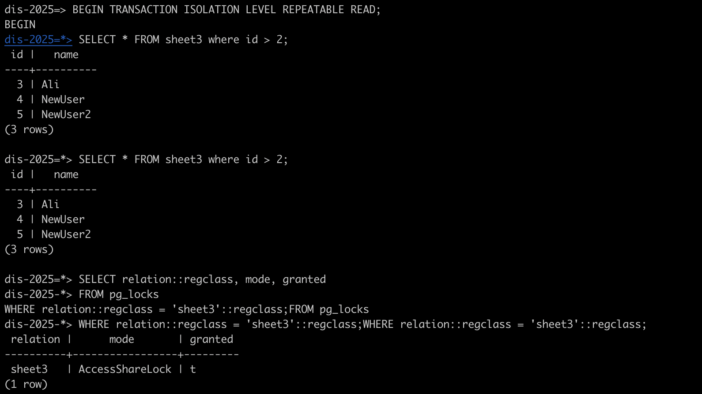
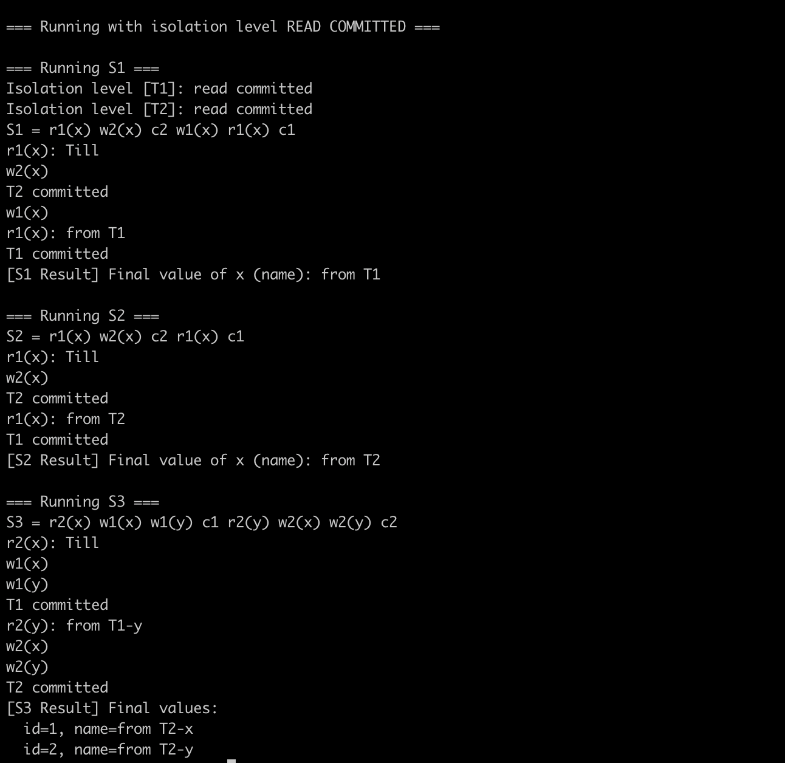
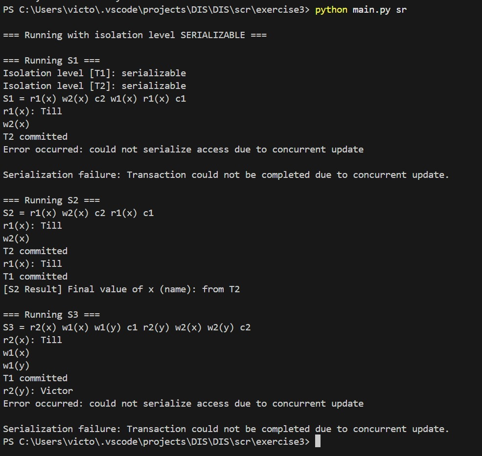

## 3.1

### a) Isolation Level in PostgreSQL

**Frage:**  
Öffne eine Verbindung zur Datenbank `dis-2025`.  
Was ist das aktuelle Isolation Level?  
Welche Isolation Levels unterstützt PostgreSQL?

**Lösung:**

```sql
SHOW TRANSACTION ISOLATION LEVEL;
```

```
read committed
```

**Unterstützte Isolation Levels in PostgreSQL:**

- `Read uncommitted`
- `Read committed` *(Standard)*
- `Repeatable read`
- `Serializable`

---

### b) Tabelle `sheet3` erstellen und mit Daten befüllen

```sql
CREATE TABLE sheet3 (
    id SERIAL PRIMARY KEY,
    name TEXT
);

INSERT INTO sheet3 (name) VALUES
  ('Victor'),
  ('Till'),
  ('Ali');
```

---

### c) Auto-Commit deaktivieren, Transaktion starten und Locks prüfen

1. **Auto-Commit deaktivieren:**  
   In `psql`:

   ```sql
   \set AUTOCOMMIT off
   ```

2. **Transaktion starten und Daten abfragen:**

   ```sql
   BEGIN;

   SELECT *
   FROM sheet3
   WHERE name = 'Till';

   SELECT relation::regclass, mode, granted
   FROM pg_locks
   WHERE relation::regclass = 'sheet3'::regclass;
   ```

3. **Ausgabe der Locks:**

   | relation | mode            | granted |
   |----------|------------------|---------|
   | sheet3   | AccessShareLock  | true    |

   **Bedeutung:**
   - `AccessShareLock`: Lesesperre – andere Transaktionen können weiterhin lesen, aber nicht exklusiv sperren.

4. **Transaktion abschließen:**

   ```sql
   COMMIT;
   ```

---

### d) Isolation Level auf Serializable setzen und erneut prüfen

```sql
BEGIN TRANSACTION ISOLATION LEVEL SERIALIZABLE;

SELECT *
FROM sheet3
WHERE name = 'Till';

SELECT relation::regclass, mode, granted
FROM pg_locks
WHERE relation::regclass = 'sheet3'::regclass;

COMMIT;
```

**Beispielhafte Ausgabe der Locks:**

| relation | mode            | granted |
|----------|------------------|---------|
| sheet3   | AccessShareLock  | true    |
| sheet3   | SIReadLock       | true    |

**Bedeutung:**
- `AccessShareLock`: Lesesperre.
- `SIReadLock`: Spezifische Sperre zur Durchsetzung der **serialisierbaren Isolation** – schützt vor Phantomen und Race Conditions.


---

## 3.2

### a)
In addition to your existing connection, open a second connection to the database (without disabling the
auto-commit). Query some rows via the first connection (isolation level RC), for example, all lines with
id > 3 (do not complete/commit the transaction of the first connection). Using the second connection,
add a new row to the table that satisfies the selection predicate. What happens? Execute the query again
via the first connection. What can be observed? Finally, execute a commit.

Der neue Eintrag erscheint -> non repeatable read

### b)


### c)
Update one row (e.g. id=1) from table sheet3 using the first connection(Still not committing) and
change another row’s NAME value (e.g. id=2) using the second connection. Then, additionally, change
the same row in transaction 2 as in transaction 1 (e.g. id=1). What happens? Does the isolation level
matter in this case? Finally, execute a commit.

- T2 wartet darauf, dass T1 commitet.
- isolation Level spielt keine Rolle, da beide Transacitonen das gleiche Objekt schreiben.


### d) Welche Aktionen führen zu einem Abbruch (Rollback)?

```text
T1: UPDATE sheet3 SET name = 'x11' WHERE id = 1;
T2: UPDATE sheet3 SET name = 'x22' WHERE id = 2;
T1: UPDATE sheet3 SET name = 'x12' WHERE id = 2;   -- T1 wartet auf Sperre von T2
T2: UPDATE sheet3 SET name = 'x21' WHERE id = 1;   -- Deadlock erkannt
T2: ROLLBACK                                       -- PostgreSQL bricht T2 ab
T1: COMMIT                                         -- T1 kann erfolgreich abschließen
```
- T2 wird durch die Datenbank **automatisch abgebrochen** (`ROLLBACK`), um den Deadlock aufzulösen.
- T1 kann anschließend **erfolgreich committen**.


## 3.3

### a) 


### b)


### c)
S1 = r1(x) w2(x) c2 w1(x) r1(x) c1

- **Abhängigkeiten:** T1 → T2, T2 → T1
- **Ergebnis:** nicht Serialisierbar  
- **Beobachtung:** Wert von `x` unterscheidet sich nicht

---
S2 = r1(x) w2(x) c2 r1(x) c1

- **Abhängigkeiten:** T1 → T2, T2 → T1
- **Ergebnis:** nicht Serialisierbar    
- **Beobachtung:** Wert von `x` unterscheidet sich nicht

---
S3 = r2(x) w1(x) w1(y) c1 r2(y) w2(x) w2(y) c2

- **Abhängigkeiten:** T1 → T2, T2 → T1
- **Ergebnis:** nicht Serialisierbar  
- **Beobachtung:** Werte von `x` und `y` unterscheiden sich nicht zu 3.3.a
